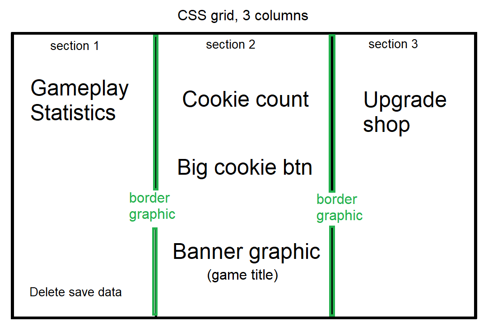

# wk03-assignment
This is for the following assignment: Week 3 -  Build a Cookie Clicker Game.

# Reflection
Compared to last week's project, I'm feeling more confident trying to figure out coding things at scale; last week I very much struggled to conceptualise how to put everything we had learned about JavaScript together to create something larger, even though I felt I could read and understand the code okay. This week, however, I have spent more time reading JavaScript code done with practical applications in mind and then practiced making various little practical page elements during our lesson workshops. I think I'm starting to get a better idea of how basic parts of JavaScript can be used to achieve a particular result. I'm also feeling more confident with DOM, and I spent time trying to think about extra gameplay elements I could put into the page by manipulating the DOM. This week, I made child elements nested inside a parent element through DOM manipulation, and I'm looking forward to trying to make more complicated stuctures for the HTML document via JavaScript code, where applicable for a project. 

I think I managed to get all the basic functionality for a Cookie Clicker game working, albeit, I ended up having to look up a lot of things and I ran into a lot of issues while coding and debugging the game as well, which I had to work around:

### Issues I ran into:
- I managed to loop through the API successfully to generate the upgrade shop buttons, but I had difficulty writing a similar loop to add functionality to the buttons based upon the values in the API, and I couldn't figure out why I was receiving error messages in the console for it. This resulted in me having to write individual functions for each button, instead of being able to truncate it down to a single `forEach` loop.
- I used the Chrome debugger to pause the script execution to check the maths of the statistics on display. This resulted in me having to set the intervals for repeating functions related to the counters (besides the interval that increases cookies per second) to very low values of 1ms. Otherwise, the statistics that appeared were values that were visually out of sync with each other, appearing to be mathematically incorrect to the player.
- Values set to 0 were initially appearing as `null` in game. I had to write some code that intentionally reset the value of these stats explicitly to "0" when the player loads the page for the first time, so that the stats were not displaying as a long list of `null` repeatedly.
- I had issues with the "Clear Save Data" button initially. Sometimes the save wouldn't delete when clicked. This seemed to be because the function that saves the game is set to run repeatedly with `setInterval()`, so I had to research how to stop that interval from running when Clear Save Data was clicked. This resulted in adding `clearInterval()` to the Clear Save Data button. Upon testing, this seems to have fixed the issue of save data not deleting.
- Very large numbers repeatedly changing within the text will cause the text counters to flicker/flash between staying on one line and going on another line, which is visually aggravating. Additionally, large numbers can be difficult for the player to read easily. I looked up how to cut off values by decimal places so that the text display for some elements would abbreviate at large numbers - e.g. display as "1.0 billion cookies" instead of "1000000000 cookies". Apparently there are JavaScript libraries that can handle this kind of abbreviation to reduce the need to rote code abbreviations for every variable that is expected/allowed to become a major large number (e.g. billion, trillion, quadrillion, and so on), which I would like to look into later. Also resulted in me learning about e notation in programming languages to abbreviate large numbers when writing code, which is very helpful.
- Clicking the page repeatedly or using an auto-clicker macro (in the real world, it is very likely that many players will use "cheats" of this kind for a clicker game) can result in the player accidentally selecting or dragging page elements. I looked up CSS styling that removes dragging and selecting from the page, which seems to have fixed the issue.

## Webpage and UI design
This project also gave me a chance to really try out different layout styles and experiment with the UI design, which was a lot of fun. I ended up making quite a few basic graphics just for the sake of trying to implement them to spice up the UI style a bit. Using CSS positioning, I tried adding graphics to the left and right side columns that appeared to seamlessly become part of the columns to either side of them, to give the layout the illusion of not being blocky, straight columns.

As for the overall game design, I used CSS grid to lay out the page, based on this wireframe:

It's very close to the original layout of Cookie Clicker. However, I ran into some limitations with this design. Unfortunately, the vast majority of the space appears blank and unoccupied on larger viewports, mainly because I don't have enough features coded into the game to occupy it. The original Cookie Clicker uses a similar adaptable layout but it works far better on large displays, simply because the game has far more items and gameplay functions to occupy the space. This includes statistics, achievements, and even minigames that the player can unlock.

I also have some concerns about graphical fidelity because I implemented graphics into the page. All the graphics I've made for the page are raster graphics (.png) files, which means their visible quality will noticeably look worse on larger displays. I don't have a vector graphic editor on my PC right now. When should it be more appropriate to use vector graphics for webpage elements over other image file types?

I am also not quite sure how I should go about styling a game like this for other devices. Should I use media queries to change the layout size to adapt to a different display? Should gameplay sections stack differently depending on the screen size (or would that frustrate a player by putting essential gameplay elements out of immediate view)? Should I consider leaving this as a desktop optimised layout and look into making a separate mobile front end or application?

A webpage that effectively appears as a single column to be scrolled through was a lot simpler to adapt to different viewport sizes, but I have a lot more questions about this when designing games becomes the matter at hand. I did give using media queries a try while I was developing the game and I managed to get the grid columns to stack on top of each other at a smaller display size, but that pretty inevitiably left me needing to restyle nearly every page element.

I think a more functional alternative view for mobile would look something like the following: The "cookie" section becomes the main view. The gameplay stats and upgrade shop become menus that can be opened and closed by clicking a button that appears on the left side and right side of the page. Maybe a small summary of the player's current progress - e.g. no. of cookies in pantry - would appear on the upgrade shop menu.

Due to me having all these concerns and questions, I've left the game on a page in a fixed-size box for now.

# Attributions
## Fonts
- Poetsen One, by John Vargas Beltrán (via Google Fonts)
    - https://fonts.google.com/specimen/Poetsen+One

- Salsa, by Rodrigo Fuenzalida, Pablo Impallari (via Google Fonts)
    - https://fonts.google.com/specimen/Salsa

## Images
- Cookie graphic, Timplaru Emil (via Vecteezy)
    - https://www.vecteezy.com/vector-art/1268053-set-of-tasty-cookies